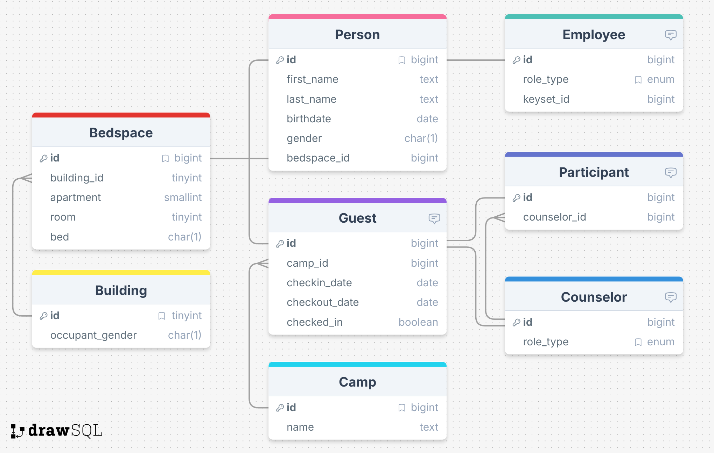

# C S 452 Natural Language (AI) SQL Project

## Database

My database models college dorm housing for FSY and other summer camps at BYU. I used the same database design that I did for the ERD design homework a couple of weeks ago, but I simplified a few of the tables. The database contains information for people (who may be employees or guests), bedspaces, and camps.

## Database Schema

## Example of a response that worked correctly

This question received similar responses for each test run and with each strategy.

    Question: "As a percentage, how many guests have not checked in yet?"

    SQL Response:
        SELECT 100.0 * SUM(CASE WHEN checked_in = 0 THEN 1 ELSE 0 END) / COUNT(*) AS percentage_not_checked_in
        FROM Guest;

    SQL Query Result:
    {
        "percentage_not_checked_in": 23.529411764705884
    }

    Friendly Response in Natural Language: "About 23.53% of the guests have not checked in yet."

## Example of a response that did not work correctly

Similar to the working response, this question received similar results from both the zero shot strategy and the single domain single shot strategy. Notably, the question is more complex than the question that recieved a working response.

    Question: "As a percentage, how many FSY 1B participants are female?"

    SQL Response:
        SELECT ROUND(100.0 * SUM(CASE WHEN p.gender = 'F' THEN 1 ELSE 0 END) / COUNT(*), 2) AS female_percentage
        FROM Participant part
        JOIN Guest g ON part.id = g.id
        JOIN Person p ON g.id = p.id
        JOIN Bedspace b ON p.bedspace_id = b.id
        WHERE b.apartment = 1 AND b.room = 2;

    SQL Query Result:
    {
        "female_percentage": null
    }

    Friendly Response in Natural Language: "The percentage of female FSY 1B participants is not available (null) based on the current data."

I decided that the AI was not sure how to interpret "FSY 1B," even though the camp name was clearly in the camp table (it seems to get the "1B" part mixed up with the bedspace assignment rather than the name of the camp), so I decided to clarify my question and try running it again.

After changing the question, both strategies were able to generate a correct query.

    Question: "As a percentage, how many of the FSY 1B camp participants are female?",

    SQL Response:
        SELECT 100.0 * SUM(CASE WHEN p.gender = 'F' THEN 1 ELSE 0 END) / COUNT(*) AS female_percentage
        FROM Participant part
        JOIN Guest g ON part.id = g.id
        JOIN Person p ON p.id = part.id
        JOIN Camp c ON g.camp_id = c.id
        WHERE c.name = 'FSY 1B';"

    SQL Query Result:
    {
        "female_percentage": 50
    }

    Friendly Response in Natural Language: "50% of the FSY 1B camp participants are female."

## Differences Between Zero Shot and Single Domain Single Shot Prompting Strategies

For the zero shot prompts, I provided the AI with the database schema, the question, and basic instructions to only return a SQLite query. For the single domain single shot prompts, I provided the AI with the same information as the zero shot prompts, along with a simple example of a question and possible SQL response.

For the most part, both strategies worked very similarly. However, there were some questions where one strategy was able to come up with a correct answer and the other didn't (and vice versa on other questions).

As an example, for the question "Who will have a birthday during the FSY 1B session?", the zero shot prompt correctly found that two participants in the FSY 1B session would have a birthday, but the single domain single shot prompt incorrectly found that no one had a birthday during the FSY 1B session (in examining the output of their responses, it would seem that the single domain single shot response uses hardcoded—and incorrect—dates whereas the zero shot uses the actual values for checkin and birthdate from the Person and Guest tables).

### Zero Shot Result:

    Question: "Who will have a birthday during the FSY 1B session?"

    SQL Response:
        SELECT p.*
        FROM Person p
        JOIN Guest g ON p.id = g.id
        JOIN Camp c ON g.camp_id = c.id
        WHERE c.name = 'FSY 1B'
            AND strftime('%m-%d', p.birthdate) BETWEEN strftime('%m-%d', g.arrival_date) AND strftime('%m-%d', g.departure_date);

    SQL Query Result:
    {
        "id": 29,
        "first_name": "Cole",
        "last_name": "Haynes",
        "birthdate": "2009-06-24",
        "gender": "M",
        "bedspace_id": 33
    },
    {
        "id": 50,
        "first_name": "Olivia",
        "last_name": "Hudson",
        "birthdate": "2010-06-23",
        "gender": "F",
        "bedspace_id": 48
    }

    Friendly Response in Natural Language: "Cole Haynes and Olivia Hudson will have birthdays during the FSY 1B session."

### Single Domain Single Shot Result:

    Question: "Who will have a birthday during the FSY 1B session?"

    SQL Response:
        SELECT p.*
        FROM Person p
        JOIN Guest g ON p.id = g.id
        WHERE (strftime('%m-%d', p.birthdate) BETWEEN '2024-06-16' AND '2024-07-27');

    SQL Query Result: []

    Friendly Response in Natural Language: "No one has a birthday during the FSY 1B session."

## Files with Other Examples

Zero Shot:

- [Version 1](response_zero_shot_1771395137391.json)
- [Version 2](response_zero_shot_1771443193177.json)

Single Domain Single Shot:

- [Version 1](response_single_domain_single_shot_1771395155412.json)
- [Version 2](response_single_domain_single_shot_1771443222054.json)
